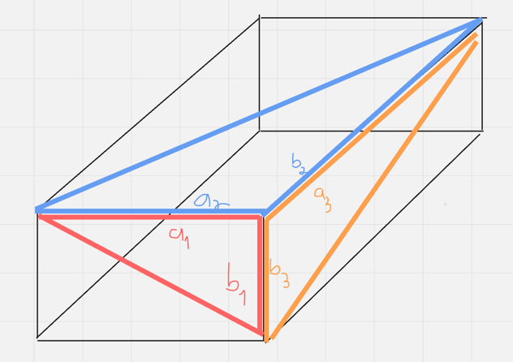

# EulerBrick

A green-fueled dive into the rabbit hole of bruteforcing a perfect euler brick.

## Main gist

Start off by computing all euler triangles in the search area.
Since we are only interested in the two sides a and b, we can
store them quite efficiently by only storing a and b.

## First part

Computing euler triangles and store them on disk:

- compute euler triangles (bruteforce approach)
- store in two files, on sorted for a and one for b

## Second Part

Iterate through all euler triangles and build a brick by finding two
appropriate triangles. The resulting cuboid is a euler brick, if

$$
a_1 = a_2 ~~\land~~ b_1 = b_3 ~~\land~~ b_2 = a_3
$$

for euler triangles $T_1, T_2, T_3$ with sides $a_n, b_n, c_n$.

Enjoy this shitty diagram!

